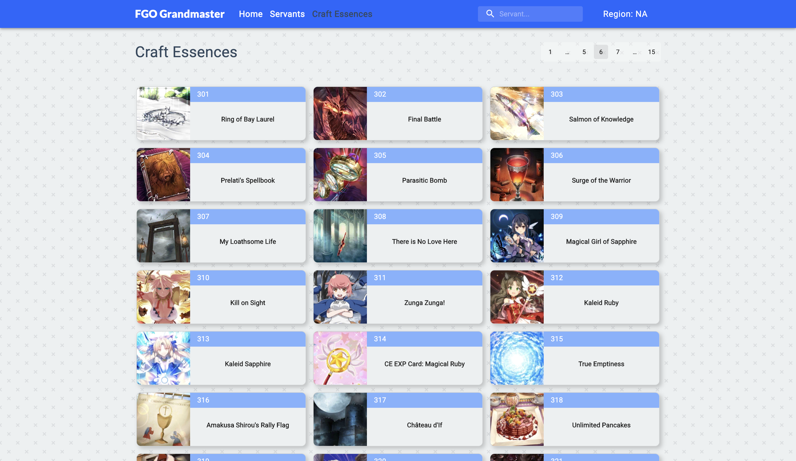
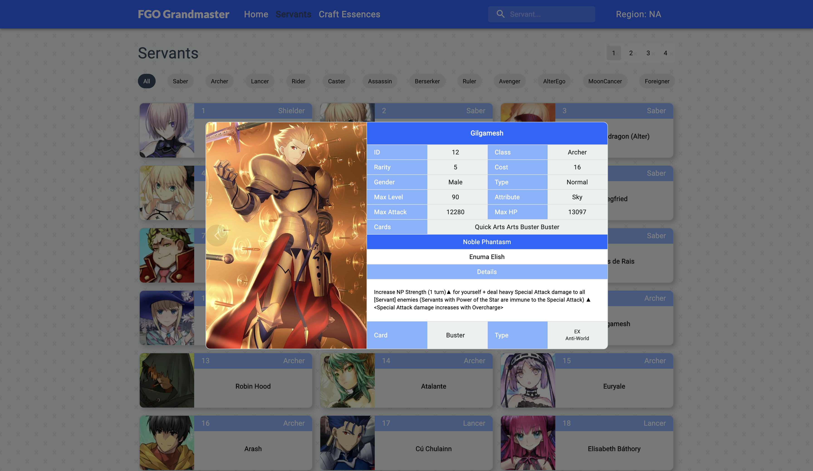

# FGO Grandmaster

FGO Grandmaster is a game assistance web application for players of the mobile game [Fate/Grand Order](https://fate-go.us/). Providing a searchable servants database for easy access to basic game information. Nice and clean interface with in-game artwork displayed for quick browsing.

## Features
- Choose between NA or JP region
- Filter servant list by class
- Search servant by name, showing the top 5 results
- Browse either Servants or Craft Essences

## Techstack
- React
- React-Router
- Material-UI
- axios

## API
[Atlas Academy](https://www.atlasacademy.io/)

### Home (NA)

### Home (JP)

### Servants

### Craft Essences

### Search

### Servant Modal
